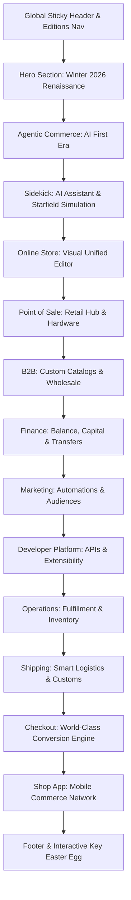

# Page Topology — Shopify Editions Winter 2026

- **Source Target:** `https://www.shopify.com/editions/winter2026`
- **Output Project:** `shopify-winter2026-clone`
- **Application Architecture:** Next-generation Hydrogen / React 18 SPA with Three.js WebGL Engine, Theatre.js Motion Timelines, and Rive Interactive Vector Animations.

---

## Section Hierarchy & Visual Flow

---

## Section Specifications & 3D Scene Matrix

| Section # | Title / Focus | 3D Scene Module | Primary 3D Models / Assets | Interactive Elements |
|---|---|---|---|---|
| **01** | Hero (Winter '26) | `HeroScene-BSrKcflv.js` | `EW26_Hero_251205_compressed-optimized.glb`, Butterflies, Particle Cloud | Scroll camera pan, butterfly orbit, lighting transitions |
| **02** | Agentic Commerce | `AgenticScene-CjbqotvP.js` | `EW26_Agentic_Props_251209v5_compressed-optimized.glb`, `Agentic_fg_251209_compressed-optimized.glb` | Interactive feature cards, floating props |
| **03** | Sidekick AI | `SidekickScene-BjZodfEY.js` | `EW26_Sidekick_251208_compressed-optimized.glb`, `EW26_Sidekick_bg_stars-optimized.glb` | Prompt demo pill buttons, starfield background |
| **04** | Online Store | `OnlineScene-BMHIFUKS.js` | `Online_fg_smaller_251127_compressed-optimized.glb`, `EW26_Online_251209v3_compressed-optimized.glb` | Live theme switcher, Rive UI cards |
| **05** | Point of Sale | `RetailScene-C_gTk6Ga.js` | `POS_v53_Hub_251208v2_compressed-optimized.glb`, `Retail_mg_251205v2_compressed-optimized.glb` | Hardware terminal rotation, feature pills |
| **06** | B2B Wholesale | `B2BScene-DkNPida2.js` | `EW26_B2B_251205v2_compressed-optimized.glb`, `B2B_fg_smaller_251127_compressed-optimizedv2.glb` | Volume pricing demo, company profiles |
| **07** | Shopify Finance | `FinanceScene-BDwc32O0.js` | `EW26_Finance_251208v2_compressed-optimized.glb`, `Finance_bg_diffuse-optimized.glb` | Balance card interactive tilt, payout calculator |
| **08** | Marketing & CRM | `MarketingScene-Dfjygwwd.js` | `EW26_Marketing_251209v4_compressed-optimized.glb`, `Marketing_fg_smaller_251127_compressed-optimized.glb` | Workflow automation preview, Rive state machine |
| **09** | Developer Platform | `DeveloperScene-BjLCbQRY.js` | `EW26_Developer_251207v5_compressed-optimized.glb`, `Developer_bg_diffuse-optimized.glb` | GraphQL query explorer, API code blocks |
| **10** | Global Operations | `OperationsScene-DdGQqwgR.js` | `EW26_Operations_251207_compressed-optimized.glb`, `Operations_bg_diffuse-optimized.glb` | Order matrix visualization, inventory tracker |
| **11** | Smart Shipping | `ShippingScene-CzO3hhHj.js` | `EW26_Shipping_251204_compressed-optimized.glb`, `Shipping_bg_diffuse-optimized.glb` | Package routing animation, rate calculator |
| **12** | World's Best Checkout | `CheckoutScene-zmnsTHZx.js` | `EW26_Checkout_251209_compressed-optimized.glb`, `Checkout_bg_diffuse-optimized.glb` | 1-click Shop Pay demo, checkout extensibility |
| **13** | Shop App | `ShopAppScene-BGpEYXgJ.js` | `EW26_ShopApp_251208v3_compressed-optimized.glb`, `ShopApp_bg_diffuse-optimized.glb` | Mobile app frame, shop cash particle effect |
| **14** | Editions Key | `EditionsKeyPopup` | `key.glb`, `Rigged_Book_CS_Animated_V5_compressed-optimized.glb` | Golden key unlock easter egg, celebration effect |

---

## Global Overlay & Navigation

- **Navigation:** Fixed frosted glass header with section jump indicators, search dialog, language switcher, and cart drawer.
- **Background Engine:** Canvas element (`#threejs-canvas`) covering 100vw x 100vh with fixed position behind HTML content layer.
- **Scroll Sync:** Scroll position drives Theatre.js sequences via `theatre-project-state` JSON interpolation, smoothly scrubbing between 3D camera viewpoints and animating object transforms.
